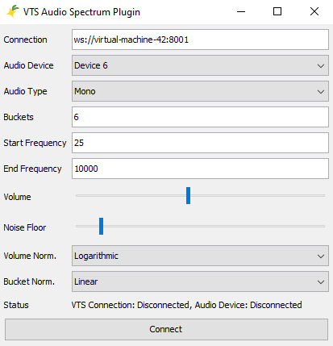

# VTube Studio FFT Audio Plugin

> Warning: This is a highly experimental plugin written to explore
> realtime animation streaming to VTube Studio.
> There are probably many issues with the code and some parts of it
> might just be wrong or non-functional.
> Use at your own risk!

> Warning: The display of the analyzed audio is delayed by roughly half to one second.
> I have not found a fix for that yet.

Demo: https://twitter.com/YuzuStr/status/1487200779417047041



## How to use it

1. You select your microphone or music source from the list of audio devices.
2. Then you configure the frequency range and number of bins to use.
   - The frequency range depends on the kind of audio you want to use.
   - 25 Hz to 10000 Hz should be enough for most uses (20 kHz is a typical upper hearing limit).
   - The number of buckets is the number of "bars" or output values you want to have.
3. You can change the volume and noise floor to match your needs.
   - The noise floor should always be lower (to the left) of your volume.
4. Enter the connection information to your VTube Studio application.
   - If it is running locally on your pc then using `ws://localhost:8001` is fine.
   - If VTube Studio is running on a different pc then using the ip of the pc like `ws://192.168.2.100:8001`.
5. Click on connect and the audio information should be streamed directly to VTube Studio

## Which parameters are supported

The name and number of used parameters depends on two configuration settings:

1. The number of buckets selected (6 is the default).
2. The number of audio channels selected (mono is the default).

Each bucket has two parameters that are created: `Level` and `Peak`
The level is the audio level for the frequency range of the bucket.
The peak is the average audio peak level for the frequency range of the bucket over a specific period of time.

When selecting mono the parameters will look like:

- `FrequencyRange1Level` and `FrequencyRange1Peak`
- `FrequencyRange2Level` and `FrequencyRange2Peak`
- `FrequencyRange3Level` and `FrequencyRange3Peak`
- ... and so on

When selecting stereo the parameters will look like (L = left audio channel, R = right audio channel):

- `FrequencyRange1LLevel` and `FrequencyRange1LPeak`
- `FrequencyRange2LLevel` and `FrequencyRange2LPeak`
- `FrequencyRange3LLevel` and `FrequencyRange3LPeak`
- ... and so on
- `FrequencyRange1RLevel` and `FrequencyRange1RPeak`
- `FrequencyRange2RLevel` and `FrequencyRange2RPeak`
- `FrequencyRange3RLevel` and `FrequencyRange3RPeak`
- ... and so on

All created parameters have a range from `0.0` (quiet) to `50` (loud).

## Configuration settings

- **Connection**: The connection url to VTube Studio (see above for examples).
- **Audio Device**: The microphone or music input to use.
- **Audio Type**: How many audio channels to use (mono or stereo).
- **Buckets**: In how many ranges to divide the frequency range (10 is the default).
- **Start Frequency**: The lowest frequency of the first bucket.
- **End Frequency**: The highest frequency of the last bucket.
- **Volume**: The volume to apply to the audio input.
- **Noise Floor**: The highest volume where audio is considered noise and cut off.
- **Volume Normalization**: How to scale the output graph (linear or logarithmic).
- **Bucket Normalization**: How to scale the bucket frequency ranges (linear or logarithmic).

# How to build

This plugin is built either directly in Eclipse or your IDE of preference
by importing it as maven project or by using maven directly.
The targets `clean` and `packge` are enough to download all dependencies and
build the JAR file.
The resulting file will be placed into the target directory with a name similar
to `vts-fft-plugin-0.0.1-jar-with-dependencies.jar`.

```bash
maven clean package
```
